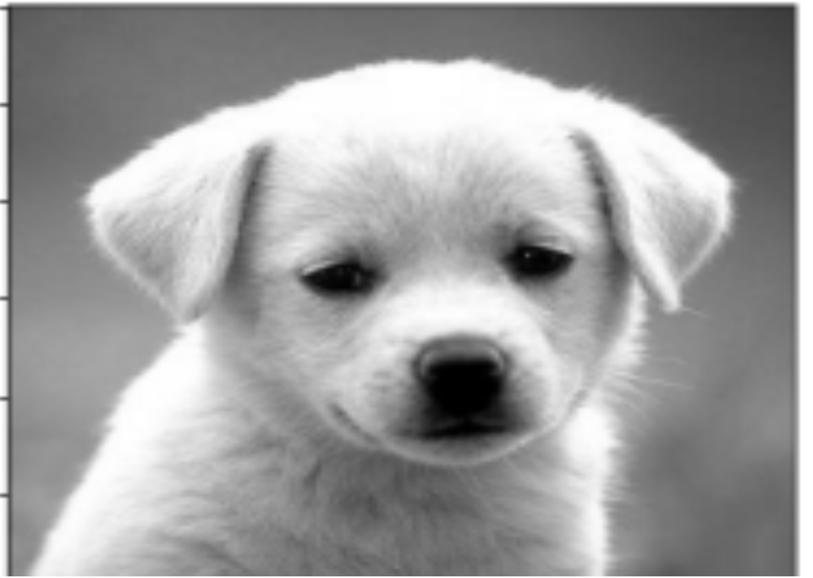
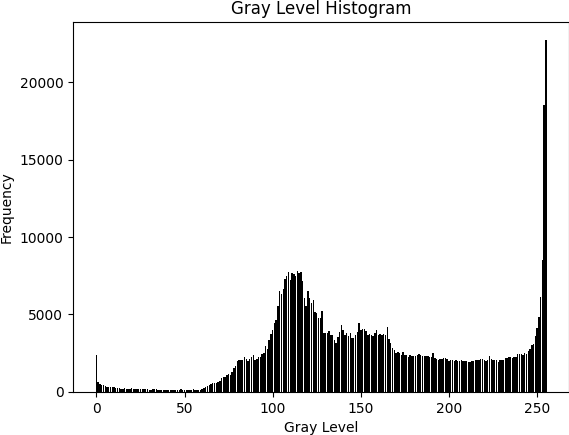

# Digital Image Processing 

A comprehensive Python-based image processing toolkit that provides various image manipulation and analysis capabilities including encryption, filtering, and histogram analysis.

## 📋 Features

- **Image Encryption/Decryption**: XOR-based encryption for secure image processing
- **Noise Reduction**: Wiener filtering for image enhancement
- **Histogram Analysis**: Both grayscale and RGB component histogram generation
- **Interactive Interface**: Menu-driven system for easy operation
- **Batch Processing**: Process all operations on an image in one go
- **Image Visualization**: High-quality matplotlib-based image display

## 🔧 Requirements

### Dependencies
```bash
pip install numpy matplotlib opencv-python pillow scipy imageio
```

### Required Libraries
- `numpy` - Numerical computing
- `matplotlib` - Plotting and visualization
- `opencv-python (cv2)` - Computer vision operations
- `PIL (Pillow)` - Image processing
- `scipy` - Scientific computing (Wiener filter)
- `imageio` - Image I/O operations

## 📁 Project Structure

```
Digital Image Processing Suite/
├── image_processing_suite.py    # Main application file
├── README.md                    # Project documentation
├── image.png                    # Sample input image
├── encrypted_image.png          # Generated encrypted image
├── decrypted_image.png          # Generated decrypted image
├── wiener_filtered.png          # Wiener filtered output
├── grayscale_histogram.png      # Grayscale histogram plot
└── rgb_histograms.png           # RGB component histograms
```

## 🚀 Quick Start

1. **Clone or download the project files**
2. **Install dependencies**:
   ```bash
   pip install numpy matplotlib opencv-python pillow scipy imageio
   ```
3. **Run the application**:
   ```bash
   python image_processing_suite.py
   ```

## 💻 Usage

### Interactive Menu System

The application provides an interactive menu with the following options:

```
==================================================
    DIGITAL IMAGE PROCESSING SUITE
==================================================
1. Load and Display Image
2. Encrypt Image
3. Decrypt Image
4. Apply Wiener Filter
5. Generate Grayscale Histogram
6. Generate RGB Histograms
7. Process All Operations
8. Exit
==================================================
```

### Command Line Usage

You can also use the `ImageProcessor` class directly in your Python scripts:

```python
from image_processing_suite import ImageProcessor

# Initialize processor
processor = ImageProcessor("path/to/your/image.png")

# Load and display image
image = processor.load_image()
processor.display_image(image, "Original Image")

# Encrypt image
encrypted = processor.encrypt_image(image)
processor.display_image(encrypted, "Encrypted Image")

# Apply Wiener filter
filtered = processor.apply_wiener_filter()
processor.display_image(filtered, "Filtered Image")

# Generate histograms
processor.plot_grayscale_histogram()
processor.plot_rgb_histograms()
```

## 📸 Example Results

### Original Image

*Sample input image for processing*

### Image Encryption Process

*XOR-encrypted version of the original image - appears as noise*

### Image Decryption Process

*Successfully decrypted image - should match the original*

### Wiener Filter Enhancement

*Image after applying Wiener filter for noise reduction*

### Histogram Analysis

#### Grayscale Histogram

*Distribution of gray levels in the image*

#### RGB Component Histograms

*Separate histograms for Red, Green, and Blue color channels*

## 🔬 Technical Details

### Image Encryption Algorithm
- **Method**: XOR-based encryption
- **Key Generation**: Pseudo-random key using NumPy (seed=42 for reproducibility)
- **Security**: Basic encryption suitable for educational purposes
- **Process**: 
  1. Generate random key matrix same size as image
  2. Apply XOR operation between image and key
  3. Store key for decryption

### Wiener Filter
- **Purpose**: Noise reduction and image enhancement
- **Implementation**: Using SciPy's signal processing module
- **Applications**: 
  - Removing Gaussian noise
  - Image restoration
  - Signal enhancement

### Histogram Analysis
- **Grayscale**: Single-channel intensity distribution
- **RGB**: Three separate color channel distributions
- **Use Cases**:
  - Image brightness analysis
  - Color distribution assessment
  - Quality evaluation

## 🎯 Use Cases

1. **Educational**: Learning image processing concepts
2. **Research**: Analyzing image properties and transformations
3. **Security**: Basic image encryption/decryption demonstrations
4. **Enhancement**: Noise reduction and image improvement
5. **Analysis**: Understanding image characteristics through histograms

## 🛠️ Customization

### Adding New Features
The `ImageProcessor` class is designed for extensibility. You can add new methods for:
- Different encryption algorithms
- Additional filters (Gaussian, median, etc.)
- Advanced histogram types
- Image transformation operations

### Configuration
- Default image path can be set during initialization
- Output file names are customizable through method parameters
- Plot styling and figure sizes can be modified in the display methods

## ⚠️ Notes

- Ensure input images are in supported formats (PNG, JPG, etc.)
- Large images may take longer to process
- Encryption key is automatically generated and stored in the processor instance
- All output files are saved in the current working directory
- The application handles errors gracefully with informative messages

## 🤝 Contributing

Feel free to contribute to this project by:
- Adding new image processing algorithms
- Improving the user interface
- Enhancing error handling
- Adding more visualization options
- Optimizing performance

## 📄 License

This project is open-source and available for educational and research purposes.

## 👨‍💻 Author

Created as part of a Digital Image Processing project.

---

*For questions or issues, please refer to the code documentation or create an issue in the project repository.*
